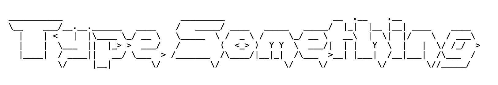

	
	
	

##  Table of Contents
1. [test1](#test1)
2. [test2](#test2)
3. [test3](#test3)

## 1.  test1 <small>[Top ▲](#table-of-contents)</small>
- [x] **x64**
- [ ] **Jetson Orin Nano**

## 2.  test2 <small>[Top ▲](#table-of-contents)</small>
|           | Memory (GB) | Binary (MB) | Freezes   |
| --------- | ----------- | ----------- | --------- |
| `row1`   | **0.17** ✅  | 10         | **No** ✅  |

## 3.  test3 <small>[Top ▲](#table-of-contents)</small>

 Folding images

## end

	Copyright &copy; [Start]-[Maintenance time/present] [Who]<a href="https://github.com/Jecjune" target="_blank">Company Org</a>

	

